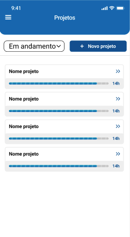
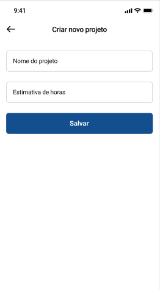
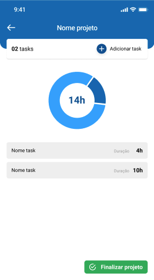
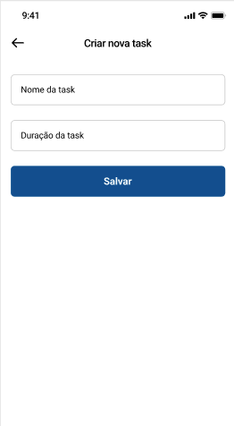
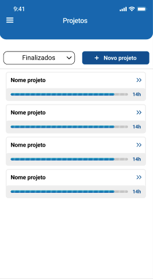
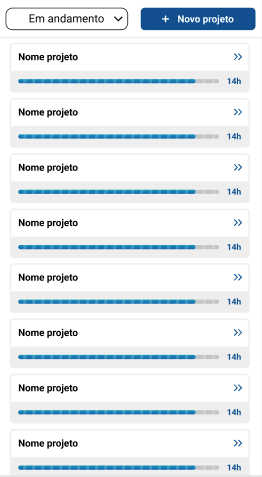

<div align = "center">
    <h1> Job Timer App </h1>
</div>
<br>

| | | | |
|:-------------------------:|:-------------------------:|:-------------------------:|:-------------------------:|
| | |||
|| | |
<br>
<!-- <h2>Telas</h2>
<ul>
    <li>Splash Page (Tela inicial do app para transição)</li>
    <li>Login (Onde possui o fluxo de login)</li>
    <li>Home (Tela principal do app e que serve de fluxo inicial para as demais telas)</li>
    <li>Cadastro Projetos (Onde possui o cadastro do novo projeto)</li>
    <li>Tela de Detalhes do Projeto (Detalhes do projeto, gráficos, tasks, evolução)</li>
    <li>Cadastro Tarefas (Onde possui o cadastro do novas tarefas de um projeto)</li>
</ul>
</div>
<br> -->

<p align="center">
 <a href="#theproject">O Projeto</a> •
 <a href="#assets">Assets</a> •
 <a href="#technologies">Funcionalidades e Tecnologias Estudadas</a> •
 <a href="#routes">Percurso</a> •
 <a href="#howtotest">Como usar</a> •
</p>
<br>

<div id="theproject">
<h2> 📓 O Projeto </h2>
<p> O Job Timer é um aplicativo de controle de horas dedicadas a um projeto.
Este foi um aplicativo construído na semana do Dart Week, um evento proporcionado pela <a href="http://academiadoflutter.com.br/">Academia do Flutter</a> </p>
</div>

<div id="assets">
<h2>📦 Assets</h2>

<p> UI Design criado para o evento: <a href="https://www.figma.com/file/eJK6AHqHXEAurdkDmvPdF2/Job-Timer?node-id=0%3A1">**Job Timer**</a> </p>
</div>

<div id="technologies">
<h2>🛠️ Funcionalidades e Tecnologias Estudadas</h2>
<ul>
    <li>Flutter Modular [https://pub.dev/packages/flutter_modular]</li>
    <br>
    <li>Flutter Modular Bloc Bind [https://pub.dev/packages/modular_bloc_bind]</li>
    <br>
    <li>Asuka (Modais) [https://pub.dev/packages/asuka]</li>
    <br>
    <li>Validatorless (Validação de formulários) [https://pub.dev/packages/validatorless]</li>
    <br>
    <li>FL Chart (Criação de Gráficos) [https://pub.dev/packages/fl_chart]</li>
    <br>
    <li>Integração com conta do Google (Firebase) 
        <ol>
            <li>Firebase Core [https://pub.dev/packages/firebase_core]</li>
            <li>Firebase Auth [https://pub.dev/packages/firebase_auth]</li>
            <li>Google Sign-In [https://pub.dev/packages/google_sign_in]</li>
            <li>Gerar SHA-1 (Comandos terminal/Powershell:): 
                <br>
                (1) MacOS/Linux
                    <br>
                    keytool -list -v -alias androiddebugkey -keystore ~/.android/debug.keystore
                    <br><br>
                    Windows
                    <br>
                    keytool -list -v -alias androiddebugkey -keystore %USERPROFILE%\.android\debug.keystore
                    <br><br>
                (2) Senha (Password): android
            </li>
            <li>Fluxo de Login e Logout com a conta do Google na aplicação</li>
        </ol>
    </li>
    <br>
    <li>Bloc [https://pub.dev/packages/bloc]
        <ol>
            <li>Flutter Bloc (Widgets) [https://pub.dev/packages/flutter_bloc]</li>
            <li>Equatable (Equals) [https://pub.dev/packages/equatable]</li>
        </ol>
    </li>
    <br>
    <li>Isar 
        <ol>
            <li>Database (Evolução do River / NoSQL) [https://pub.dev/packages/isar]</li>
            <li>Isar Libs (Contém os binários) [https://pub.dev/packages/isar_flutter_libs]</li>
            <li>Isar Generator [https://pub.dev/packages/isar_generator]</li>
            <li>Path Provider (Onde salvar / diretório) [https://pub.dev/packages/path_provider]</li>
        </ol>
    </li>
    <br>
    <li>Build Runner (Geração dos códigos) [https://pub.dev/packages/build_runner]</li>
    <br>
    <li>Tint and Shade Generator (Colors Palette) [https://maketintsandshades.com/]</li>
</ul>
</div>

<div id="routes">
<h2>🔎  Percurso</h2>
<ul>
    <li><strong>Aula 1</strong></li>
    <ol>
        <li>Apresentar o projeto</li>
        <li>Criando o projeto</li>
        <li>Configurando dependências</li>
        <li>Configurando tema</li>
        <li>Adicionando ícones</li>
        <li>Configurando Firebase</li>
        <li>Construir tela de Splash Page</li>
        <li>Configurando módulo de login</li>
        <li>Configurando módulo de home</li>
        <li>Adicionando interceptor do FirebaseAuth</li>
        <li>Adicionando assets de imagens ao projeto</li>
        <li>Construindo tela de login</li>
        <li>Fazer login do usuário no Firebase</li>
    </ol>
    <br>
    <li><strong>Aula 2</strong></li>
    <ol>
        <li>Fazer login com o Google</li>
        <li>Criando conexão com o banco de dados</li>
        <li>Preparar as Entities</li>
        <li>Construir a primeira parte da tela de HomePage</li>
        <li>Inspector (Windows e MacOS)</li>
    </ol>
    <br>
    <li><strong>Aula 3</strong></li>
    <ol>
        <li>Construir módulo de cadastro de projeto</li>
        <li>Carregar os projetos</li>
        <li>Apresentar o projeto em um ListTile simples</li>
        <li>Construir componente de apresentação do projeto</li>
        <li>Implementar o filtro de projetos</li>
    </ol>
    <br>
    <li><strong>Aula 4</strong></li>
    <ol>
        <li>Construir componente de apresentação do projeto</li>
        <li>Implementar a atualização de projetos ao incluir um novo</li>
        <li>Implementar o filtro de projetos</li>
        <li>Implementar botão com loader</li>
        <li>Criar tela de detalhe</li>
    </ol>
    <br>
    <li><strong>Aula 5</strong></li>
    <ol>
        <li>Implementar tela de detalhe</li>
        <li>Criar tela de nova task</li>
        <li>Implementar tela de nova task</li>
        <li>Atualizar detalhe do projeto com a task nova</li>
    </ol>
    <br>
</ul>
</div>

<div id="howtotest">
<h2>🧪Como usar</h2>

   ```
   Configure o ambiente de desenvolvimento na sua máquina:
   https://flutter.dev/docs/get-started/install

   - Clone o repositório:
   $ git clone https://github.com/alexandrecpedro/job_timer_app

   - Entre no diretório:
   $ cd job_timer

   - Instale as dependências:
   $ flutter pub get

   - Execute:
   $ flutter run

   - Execute Build.Runner:
   flutter pub run build_runner watch --delete-conflicting-outputs
   ```

---

<h2>Como contribuir</h2>

   ```
   - Fork o projeto 

   - Cria uma nova branch com suas mudanças:
   $ git checkout -b my-feature

   - Salve suas mudanças e faça uma mensagem de commit message sobre suas alterações:
   $ git commit -m "feature: My new feature"

   - Envie suas mudanças:
   $ git push origin my-feature
   ```
</div>